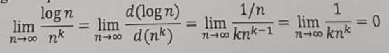
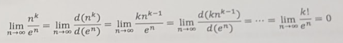

# Quiz 3 Review

## Time and Space Complexity

Factors affecting the running time, **t**, of a program:
1. Input size, n
2. Number of steps to perform individual commands, E
3. Number of machine cycles for each step, R
4. Actual wall-clock time for a machine cycle, D

All together: `t = T(n, E, R, D)`

The **input size** of an algorithm is quantified by the *length* of the string representation of the input.

### Big-O Notation

**T(n) = O(f(n))**

We say that T(n) is *upper bounded* by f(n) if there exists a constant c &gt; 0 and n<sub>0</sub> &gt; 0 such that for all n &geq; n<sub>0</sub> we have T(n) &leq; cf(n).

### Big-&Omega; Notation

**T(n) = &Omega;(f(n))**

We say that T(n) is *lower bounded* by f(n) if there exists a constant &epsilon; &gt; 0 and n<sub>0</sub> &gt; 0 such that for all n &geq; n<sub>0</sub> we have T(n) &geq; &epsilon;f(n).

### Big-&theta; Notation

**T(n) = &theta;(n)**

We say that T(n) is *tight bounded* if T(n) &in; O(f(n)) and T(n) &in; &Omega;(f(n).

> Show that if f and g are two functions such that lim(f(n) / g(n)) = c &gt; 0, then f(n) = &theta;(g(n)).

Based on the definition of limit, we have for some n<sub>0</sub>, we have:

c - &epsilon; &leq; f(n) / g(n) &leq; c + &epsilon; for all n &geq; n<sub>0</sub>

After rearrangement of the terms, we will have:

(c - &epsilon;)g(n) &leq; f(n) &leq; (c + &epsilon;)g(n)

So, based on the definition of upper bound and lower bound, we have f(n) = O(g(n)) and f(n) = &Omega;(g(n)) and eventually f(n) = &theta;(g(n)).

### Proofs

> Show that logarithm time grows slower than polynomial time.

We can use L'Hospital's rule:




> Show that polynomial time grows slower than exponential time.

We can use L'Hospital's rule:



## Independent Set Problem

An independent set is a subgraph that exists no edge; the size of the independent set is defined by the number of vertices contained. Given a graph G, devise an algorithm to check if G contains a size k independent set. Perform analysis of your algorithm.

### Algorithm

```
foreach subset S of k nodes
  check whether S is an independent set
  if (S is an independent set)
    report S is an independent set
  endif
endfor
```

### Analysis

The number of times the for loop is executed is (n k) since there are (n k) combinations of size k subgraphs. We have:

(n k) = n * (n - 1) * . . . (n - k - 1) / k! &leq; n<sup>k</sup> / k! which leads to O(n<sup>k</sup>) for loop executions.

Since k is a constant, checking whether a size k subgraph is an independent set takes O(1) time.

Thus, the overall time complexity is O(n<sup>k</sup>).

## Comparison-Based Sorting Algorithm

All comparison-based sorting algorithm require &Omega;(nlogn) time.

### Proof

There could be many different inputs to the algorithm, i.e. different orders of numbers. More precisely, there could be n! different inputs.

Note that sorting the input numbers is equivalent to finding the permutation(s) that have the sorted order.

We can ask to compare any two numbers in the list. Once we obtain the answer, the number of inputs will be partitioned into two groups, a group that contains inputs that are consistent with the answer and the other group that contains inputs that are not consistent with the answer.

In the worst-case scenario, we will end up with the group with more numbers consisting the answer to our question. In this case, the size of the valid inputs is reduced at most by half for each question we ask. In this case, we have to ask log<sub>2</sub>n! questions to eventually reduce the number of valid inputs to 1.

Using Stirling's approximation, we can derive &Omega;(nlogn).

## Hashing

Assuming the input size to be n, the complexities in a *closed* hash table are:
* Insertion: O(1)
* Deletion: O(n)
* Search: (n)

A **hash table** is useful because of the **hash function**, f(x), that takes only O(1) time to locate a value with key x in the table.

### Properties of a Hash Table

* k: load factor
* n: number of key-value pairs in the hash table
* m: number of *buckets* in the hash table

k = n / m

O(k) = O(n / m)

Typically, n and m should be rought the same size. Hence:

O(n / m) &equiv; O(1) &equiv; O(n) &equiv; O(m)

### Table-Doubling

The number of entries in a hash table will be dynamically allocated. In this case, as the hash table gets almost full, we double the size.

```
insert(T, x):
if |T.arr| = 0 then
  T.arr = new array of size 1;
endif
if T.num = |T.arr| then
  arr0 = new array of size 2|T.arr|;
  rehash all items for T.arr to arr0;
  T.arr = arr0;
endif
T.arr[T.num] = x;
T.num++;
return;
```
In the worst-case scenario, it takes O(m) time to insert one element. Hence, to insert n elements, it will take O(n * m) &equiv; O(n<sup>2</sup>) since n &approx; m.

#### Proofs

Note: O(m) time for each insertion does not meet expectations. This is because we are too pessissmistic about how often table-doubling gets triggered.

> Use the **aggregation method** to show that the amortized time complexity for each insertion with table-doubling is O(1).

We notice that the cost of each doubling is not n, but in fact the number of elements in the hash table at the time when table-doubling is triggered. As a result, at the first table-doubling event, we are rehashing 1 item, at the second table-doubling event, we are rehashing 2 items, and so on. In the last doubling event, we are rehashing 2<sup>log<sub>2</sub>n</sup> items. Combining these facts, we can easily compute the total table-doubling cost while inserting n keys into the hash table:

T = 1 + 2 + 4 + . . . + 2<sup>log<sub>2</sub>n</sup> = 2<sup>log<sub>2</sub>n</sup> / 2 - 1 = n - 1 = O(n).

As n insertions take O(n) to finish, on average we have that each insertion takes O(1) time.

> Use the **accounting method** to show that the amortized time complexity for each insertion with table-doubling is O(1).

We can think of the insertions that do not trigger table-doubling as operations that deposit credits into our bank account and insertions that do trigger table-doubling as operations that withdraw from our bankc account.

Observe that the array is half-full right after a table-doubling. While we keep inserting keys into the table prior to triggering the next table-doubling event, we can have these insertions deposit $2 into the bank account and also imagine that each of such insert cost $1.

Assuming that the current hash table has a size of 2m, then inserting m items into the hash table until full will leave $2m in the bank account. $2m is sufficient to pay the cost of migrating all these 2m elements to the new memory block.

In this case, a table-doubling cost nothing and each insertion would cost $3 ($1 for inserting itself, $2 for depositing in the bank account). Because the cost we deposit for each insertion step is a constant, we can claim that it has a time complexity of O(1).

### Table-Halving

Similar to table-doubling, as we size of the hash table reduces to 1/4 of the array, we halve the table.

```
delete(T, x):
if |T.arr| = 0 then
  error;
endif
delete x from T;
T.num--;
if T.num <= 1/4|T.arr| then
  arr0 = new array of size 1/2|T.arr|;
  copy data from T.arr to arr0;
  T.arr = arr0;
endif
return;
```

#### Proofs

> Use the **accounting method** to show that the amortized time complexity for each deletion with table-halving is O(1).

We can think of the deletion operations that do not trigger table-halving as operations that deposit credits to our account, and deletions that do trigger table-halving as operations that withdraw from our account.

Assume that the table is half-full right after a table-halving. We will have a deletion operation that do not trigger table-halving contribute $1 to the bank account such that it will cost $2 in total.

Assume that the current hash table has a size of 2m and it is half-full right after a table-halving event. To trigger a table-halving, we need to have at least m/2 deletions. The bank account thus has $m/2 which is sufficient to pay for rehashing the remaining m/2 elements to the new memory block.

As a result, deletions that trigger table-halving will not cost any money and the amortized complexity for deletion is O(1).

> Use the **accounting method** to show that the amortized time complexity for each insertion and deletion with table-doubling and table-halving is O(1).

Imagine at a given point where the array has size of 2m and is half full. This is possible if we simply assign the initial hash table with size 2. Given the above proofs, we can have any insertion to deposit $2 into the bank and each deletion to depost $1 into the bank.

If the next size-changing operation is table-doubling, then there are at least m insertions and our bank account will have $2m to pay for the table-doubling cost.

If the next size-changing operation is table-halving, then there are at least m/2 deletions and our bank account will have $m/2 to pay for the table-halving cost.

It follows that each insertion and deletion takes O(1) time even if they come in random order.